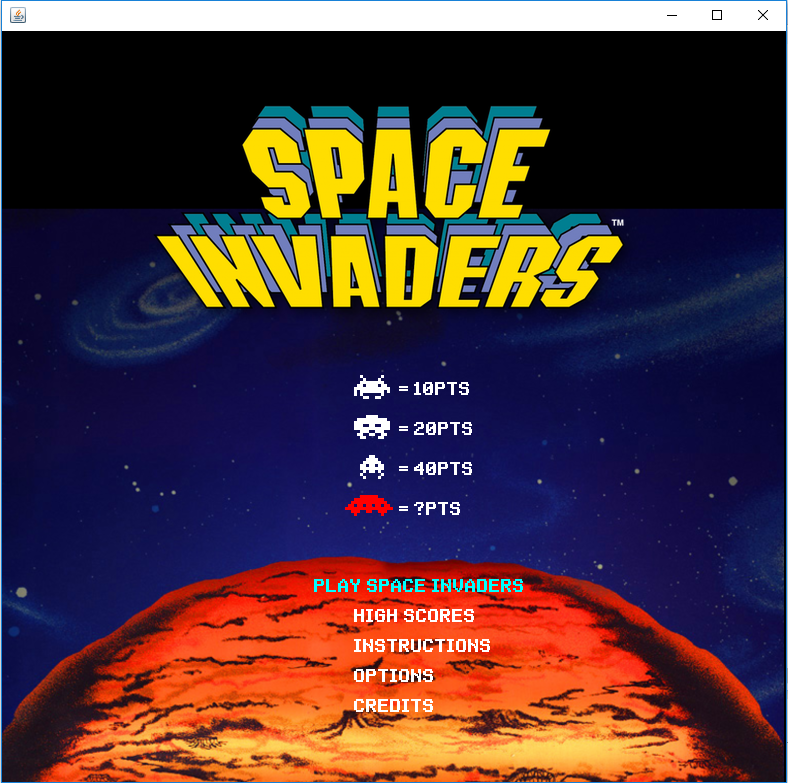
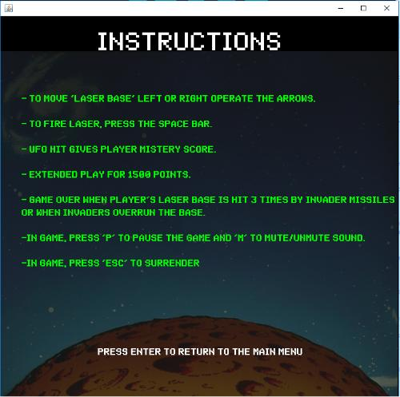
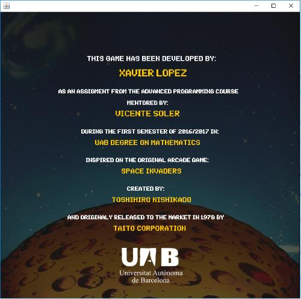
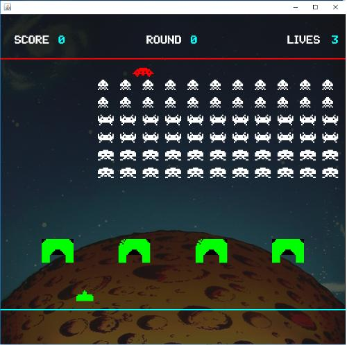
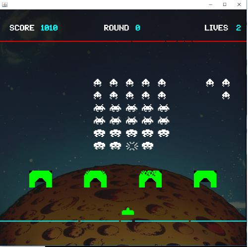
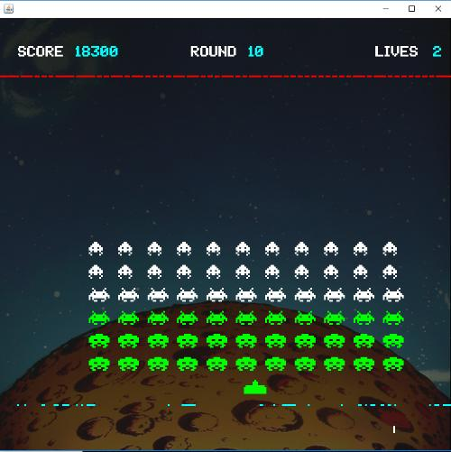
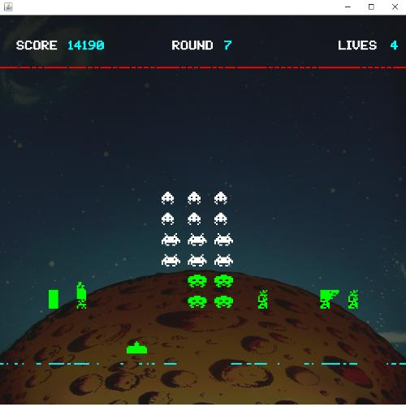
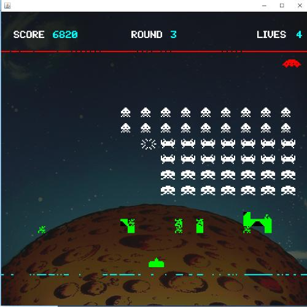
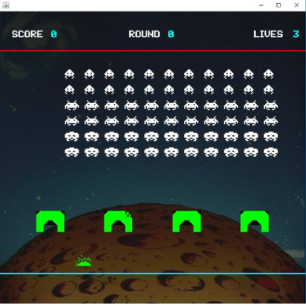

# space-invaders
Space Invaders game developed in Java.

This game has been fully developed by Xavier López as an assigment of the class "Advanced Programming", Bachelors degree in Mathematis at UAB.

## Getting Started
In this repository there are two java projects:
	-Space Invaders
	-Space Invaders2

The difference between those two projects is that the first is a java application, and the second is a java applet.

The "Space Invaders2" project could (or should) be a branch of the same project, however I prefer to keep them separated at the moment.

Java applets are not very used nowadays, however it has let me show my project to the world very easily, the game is public in xavierlopeze.github.io. Please not that this public java applet does not use any resources like images or sound, in contrast to the projects presented in this repository.

Please note that "SpaceInvaders.zip" file is just a copy of the folder "Space Invaders".

## Guided Run

Once you execute the Space Invaders project (please note that Finestra.java is the main file) you should see

To navigate trough the  menus use the arrows, and to select a menu use enter. Once in the menu, if you want to go back to the main page press enter again.

Thats enough instructions for you to use the applet, I leave some screenshots here:

Please note that the menu "high scores" was meant to be using a server and a conection http to save the tom 10 highest scores from everyone who played this game. Sadly this is not implemented yet and it saves the highest score from the execution you are in.

Please note that the menu "options" it is also to be developed in the future.

Enjoy the game!

## Acknowledgments
Special thanks to Vicenç Soler for his teachings.

## Author 
Xavier López

Contact:  xavier.lopeze@gmail.com
